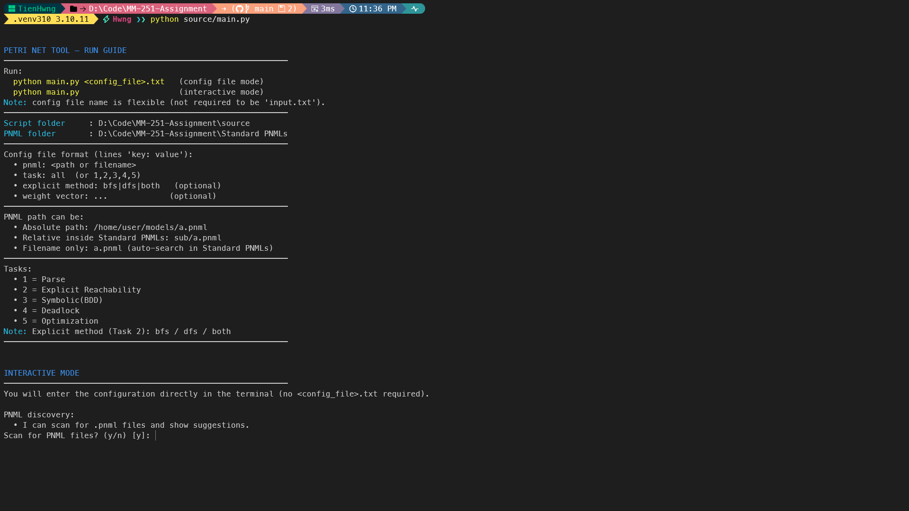
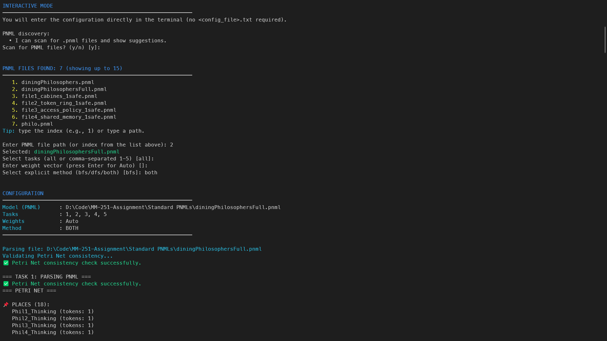

# MM251 – Petri Net Analysis (Explicit, Symbolic, Deadlock, Optimization)

This repository contains our implementation for the MM-251 / CO2011 assignment on **symbolic and algebraic reasoning in 1-safe Petri nets**.

The project provides:

- Explicit reachability (BFS / DFS)
- Symbolic reachability using BDDs
- Deadlock detection (symbolic intersection + CEGAR reference)
- Optimization over reachable markings
- A unified `main.py` driver to run all tasks from a simple config file (or interactive mode)

---

## Table of Contents

- [1. Project Overview](#1-project-overview)
- [2. Python Version & Dependencies](#2-python-version--dependencies)
  - [2.1. Virtual Environment (recommended)](#21-virtual-environment-recommended)
- [3. Repository Structure](#3-repository-structure)
- [4. Assignment Task Mapping](#4-assignment-task-mapping)
- [5. Configuration File (Config `.txt`)](#5-configuration-file-config-txt)
  - [5.1. Format](#51-format)
  - [5.2. Example Config File](#52-example-config-file)
- [6. Quick Start (For Instructor / TA)](#6-quick-start-for-instructor--ta)
  - [6.1. Run everything using a config file](#61-run-everything-using-a-config-file-recommended)
  - [6.2. Run everything using interactive mode](#62-run-everything-using-interactive-mode-no-config-file)
- [7. How to Run (Detailed)](#7-how-to-run-detailed)
  - [7.1. Running the unified driver (`main.py`)](#71-running-the-unified-driver-mainpy)
  - [7.2. Running individual modules](#72-running-individual-modules-for-debugging--demo)
  - [7.3. Benchmark runner (`benchmark_runner.py`)](#73-benchmark-runner-testbenchmark_runnerpy)
- [8. Adding New PNML Models](#8-adding-new-pnml-models)
- [9. Limitations & Assumptions](#9-limitations--assumptions)
- [10. Credits](#10-credits)


---

## 1. Project Overview

The goal of the assignment is to analyze **1-safe Petri nets** using both **explicit** and **symbolic** techniques, and to reason about:

- **Reachable markings**
- **Deadlock states**
- **Optimal markings** with respect to a linear objective function

Our implementation:

- Parses **PNML** models into an internal `PetriNet` structure.
- Computes reachable markings via **BFS / DFS**.
- Uses **BDD-based symbolic representations** to compute the reachable state space.
- Detects deadlocks by intersecting the reachable set with a “no enabled transition” condition.
- Optionally runs an **optimization pipeline** combining explicit and symbolic analysis.
- Exposes a single entry point: `main.py`, which reads a simple configuration file and runs the selected tasks.

---

## 2. Python Version & Dependencies

> ⚠️ **Important:** This project is developed and tested **only** with:
>
> - **Python 3.10.11**

Other versions (3.9, 3.11, 3.12, …) may cause:

- Import errors with BDD / ILP / SAT libraries  
- Behavior differences in typing or 3rd-party APIs  
- Inconsistent benchmark results  

Please make sure your `python` is exactly **3.10.11**.

**Examples:**

- For Windows (py launcher)
```bash
py -3.10 --version   # must print Python 3.10.11
```

- For Unix/macOS (pyenv)
```bash
pyenv install 3.10.11
pyenv local 3.10.11
python --version     # Python 3.10.11
```

### 2.1. Virtual environment (recommended)

From the repository root:

```bash
python -m venv .venv
```

or:
```bash
py -3.10 -m venv .venv
```

Activate:

- Windows:
```bash
.\.venv\Scripts\activate
```

- Linux/macOS:
```bash
source .venv/bin/activate
```

Upgrade pip and install dependencies:
```bash
pip install --upgrade pip
pip install -r requirements.txt   # if provided
```

If `requirements.txt` is not present, install the main libraries used:
```bash
pip install dd pyeda pulp
```

---

## 3. Repository Structure

> Chú ý: Project **không dùng `__init__.py`**, nên không import theo kiểu package (`from source.xxx import ...`).  
> Mỗi file `.py` được chạy như một script bình thường, và `main.py` đóng vai trò entry point chính.

A typical layout:

```text
MM-251-ASSIGNMENT/
├── Standard PNMLs/                    # Example PNML models for testing/benchmarking
│   ├── DocAndPatient.pnml
│   ├── diningPhilosophers.pnml
│   ├── diningPhilosophersFull.pnml
│   ├── file2_token_ring_1safe.pnml
│   ├── file3_access_policy_1safe.pnml
│   └── philo.pnml
│
├── source/
│   ├── parser.py
│   ├── reachability.py
│   ├── symbolic_computation_BDD.py
│   ├── symbolic_pyeda.py
│   ├── deadlock_detection.py
│   ├── deadlock_detection_cegar.py
│   ├── optimization.py
│   └── main.py                        # ⭐ Integrated driver for Tasks 1–5
│
├── test/
│   └── benchmark_runner.py
│
└── README.md
```

---

## 4. Assignment Task Mapping

| Task | Description (from assignment)                          | Implementation in this repo                          |
|------|--------------------------------------------------------|------------------------------------------------------|
| 1    | Parse PNML → internal Petri net                        | `source/parser.py` |
| 2    | Explicit reachability (BFS / DFS)                      | `source/reachability.py` |
| 3    | Symbolic reachability via BDD                          | `source/symbolic_computation_BDD.py` |
| 4    | Deadlock detection (logical + ILP / CEGAR-style)       | `source/deadlock_detection.py`, `deadlock_detection_cegar.py` |
| 5    | Optimization over reachable markings (optional)        | `source/optimization.py` and `run_task_5` in `main.py` |
| 6    | Report & discussion                                   | Separate PDF report |

`main.py` ties these modules together and reproduces the behavior of the individual scripts while allowing everything to be configured via an external config file.

---

## 5. Configuration File (Config `.txt`)

Instead of passing long command-line arguments, `main.py` uses a simple text configuration file.

### 5.1. Format

`main.py` expects a file with key–value pairs, one per line:

- Lines can contain comments after `#`
- Keys are case-insensitive
- Supported keys:

| Key             | Meaning                                             | Example                         |
|-----------------|-----------------------------------------------------|---------------------------------|
| `PNML`          | Path (or filename) of the PNML model                | `PNML: ../Standard PNMLs/philo.pnml` |
| `Task`          | Which tasks to run (`1–5` or `all`)                 | `Task: all` or `Task: 1,2,4`    |
| `Weight Vector` | Weight specification for optimization (Task 5)      | `Weight Vector: P1=10,P2=5`     |
| `Explicit Method` | Explicit method for Task 2 (`bfs`, `dfs`, `both`) | `Explicit Method: both`         |

✅ **Note:** the config file name is **NOT fixed**.  
You may name it `input.txt`, `config.txt`, `run.txt`, etc.

### 5.2. Example config file

```text
# Example configuration for main.py
PNML: ../Standard PNMLs/diningPhilosophers.pnml

Task: all
Weight Vector: P1=10, P2=5
Explicit Method: both
```

`main.py` will:

- Parse this file using `parse_config_file()`
- Resolve the PNML path using `resolve_path()`:
  - It accepts absolute paths
  - It accepts paths relative to `source/`
  - It can also find PNMLs inside the folder `Standard PNMLs/` (sibling folder of `source/`)
- Run selected tasks in ascending order (1 → 5)

---

## 6. Quick Start (For Instructor / TA)

This section shows how to run the **full pipeline** (Tasks 1–5) quickly.

### 6.1. Run everything using a config file (recommended)

From the repository root:

```bash
cd source
python main.py ../input.txt
```

- `../input.txt` can be any config file name/path (not required to be `input.txt`)
- The PNML path inside config can be absolute or relative

### 6.2. Run everything using interactive mode (no config file)

If you run without providing a config file:

```bash
cd source
python main.py
```

The program will:

- Scan `Standard PNMLs/` and list available `.pnml` files
- Ask you to select:
  - PNML model
  - Task list (or `all`)
  - Explicit method (bfs/dfs/both)
  - Weights (optional)

After execution, the program first prints a run guide, including:
- How to run in config-file mode and interactive mode
- The detected script folder (`source/`) and PNML folder (`Standard PNMLs/`)
- The expected format of the configuration file
- Supported tasks and explicit methods

If no config file is provided, the program then enters an interactive mode,
where the user is prompted to:
- Scan and select a PNML model
- Choose which tasks to run
- Select the explicit reachability method
- Optionally specify a weight vector for optimization

Here is an example:

[](docs/run_guide.png)

After printing the run guide, the tool enters **Interactive Mode**.  
TAs can follow the prompts to choose the PNML model and select which tasks to run.  
Press `Enter` to quickly accept the default option (shown in brackets).

Here is an example of the inputs expected in Interactive Mode:

[](docs/interactive_inputs.png)

---

## 7. How to Run (Detailed)

### 7.1. Running the unified driver (`main.py`)

1. Create/edit a config file (any name), as described in Section 5.
2. From the repository root:

```bash
cd source
python main.py ../input.txt
```

Explanation:

- `main.py` imports `parser`, `reachability`, `symbolic_computation_BDD`, `deadlock_detection`, `optimization` as plain modules (not `source.*`).
- Therefore, we recommend:
  - `cd source`
  - run `python main.py <path-to-config-file>`

---

### 7.2. Running individual modules (for debugging / demo)

#### 7.2.1. Explicit reachability (`reachability.py`)

```bash
cd source
python reachability.py --model ../Standard\ PNMLs/philo.pnml --method bfs
python reachability.py --model ../Standard\ PNMLs/philo.pnml --method dfs
```

#### 7.2.2. Symbolic reachability (`symbolic_computation_BDD.py`)

```bash
cd source
python symbolic_computation_BDD.py --model ../Standard\ PNMLs/philo.pnml
```

#### 7.2.3. Deadlock detection (`deadlock_detection.py`)

```bash
cd source
python deadlock_detection.py --model ../Standard\ PNMLs/philo.pnml
```

#### 7.2.4. Optimization (`optimization.py`)

```bash
cd source
python optimization.py --model ../Standard\ PNMLs/diningPhilosophers.pnml
python optimization.py --model ../Standard\ PNMLs/diningPhilosophers.pnml --weights "P1=10,P2=5"
```

---

### 7.3. Benchmark runner (`test/benchmark_runner.py`)

```bash
cd test
python benchmark_runner.py --dir "../Standard PNMLs"
```

---

## 8. Adding New PNML Models

1. Put your `.pnml` file into:

```text
Standard PNMLs/
```

2. Update your config file:

```text
PNML: ../Standard PNMLs/my_model.pnml
Task: all
Explicit Method: both
```

3. Run:

```bash
cd source
python main.py ../input.txt
```

---

## 9. Limitations & Assumptions

- The code assumes **1-safe Petri nets**.
- Massive models may cause:
  - State explosion for explicit BFS/DFS
  - Memory issues for symbolic BDD reachability
- Python version is **strictly pinned** to `3.10.11` because the assignment was developed and tested on this version; using other versions may cause dependency/import issues and inconsistent results.
- The project is not packaged as a Python module; all scripts are run directly.

---

## 10. Credits

- Course: **MM-251 / CO2011 – Mathematical Modeling**  
- Assignment theme: *Symbolic and Algebraic Reasoning in Petri Nets*  
- Instructor: *Dr. Trinh Van Giang*  
- Implementation: *Group 12*  
- Tools:
  - Python **3.10.11**
  - BDD/ILP libraries (`dd`, `pyeda`, `pulp`, …)
